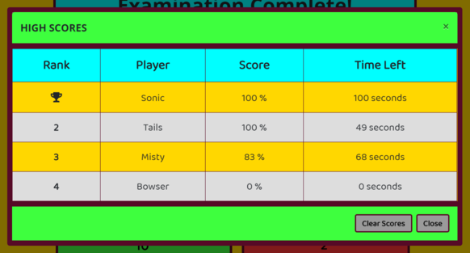

**# Depth of Knowledge Exam: JavaScript Edition**

**[Run-Application!](https://jmantis0.github.io/depth-of-knowledge-javascript-edition/)**

This fun, interactive quiz application tests your knowledge of basic JavaScript concepts and syntax!

**## Features** 

**### Score Tracking**
Scores for every quiz taken can optionally be recorded to the HIGH SCORES leaderboard.  These scores persist even after the browser is closed or refreshed.  This allows you to track your progress compared to your previous performances and performances of other players.

**### Tickdown timer**  Once a quiz begins your time is running!  In addition to testing your knowledge of concepts, this feature also allows you to track and gauge your speed.

**### REPLAY VALUE** 
*Dynamic randomization*:  This application is designed to make each quiz fresh and different by presenting the questions in a random order.   Additionally, the answer choices for each question are positioned randomly among the answer buttons.  This means no two quizzes will be the same, and you can't just rely on muscle memory.

**### Immersive Content**  
Application is designed with fun sounds and dynamic CSS styling, making it not only educational, but fun too!

**### Responsive Design** 
 Application utilizes the Bootstrap CSS Framework to be fully functional across browser sizes and mobile devices.

**## Contributors**
My thanks to [freesound.org](https://freesound.org/) for their free sound downloads.

Thanks to [NCH Software](https://www.nch.com.au/wavepad/index.html?kw=free%20audio%20editor&gclid=CjwKCAjwv4_1BRAhEiwAtMDLssCOnw4cMOqnj9KlL7BQam6e8zr_m4ZUXx3Wel4fqAtpEvZ37K-6PBoCrLkQAvD_BwE) for their free audio editing software.

Thanks to [Bootstrap CSS Framework](https://getbootstrap.com/) for their open source CSS library.

Thanks to [Font Awesome](https://fontawesome.com/) for their free icons and CSS support.

